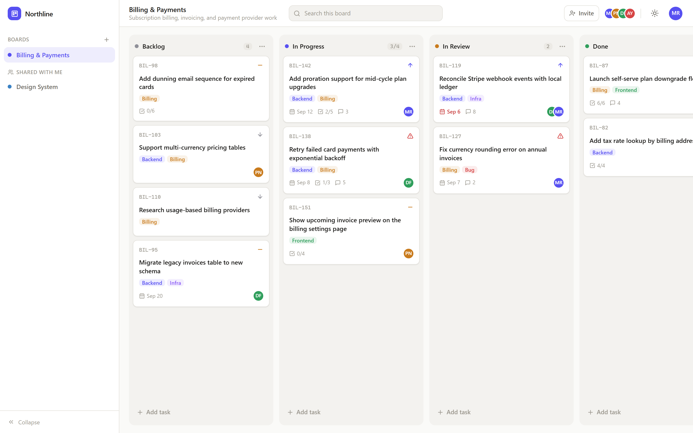
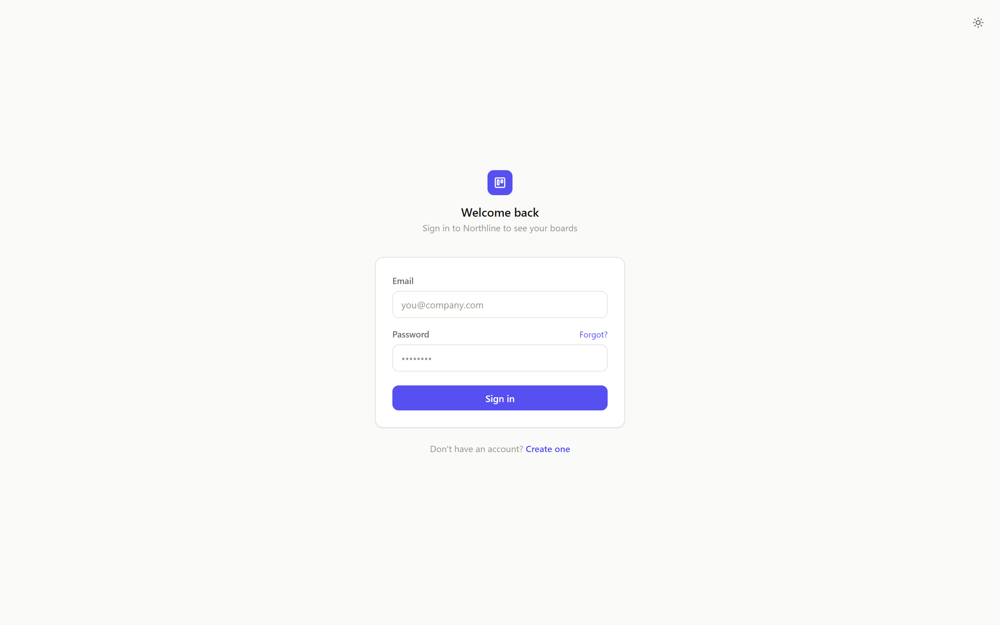
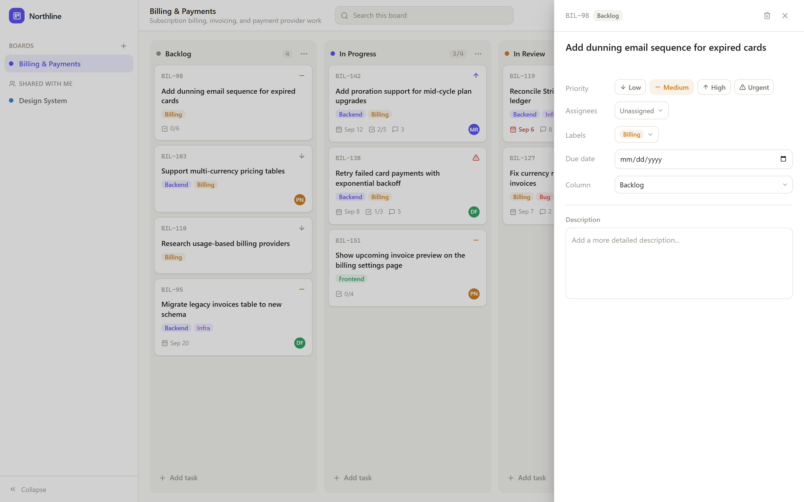
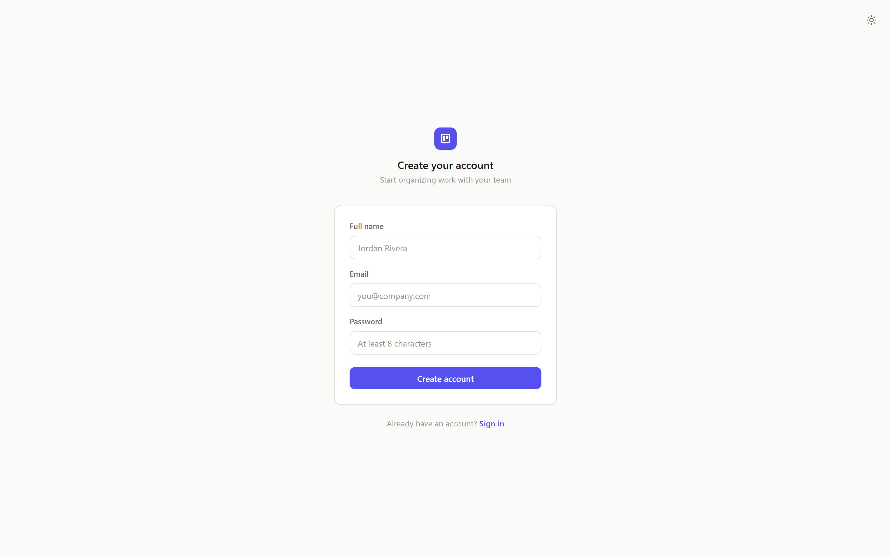
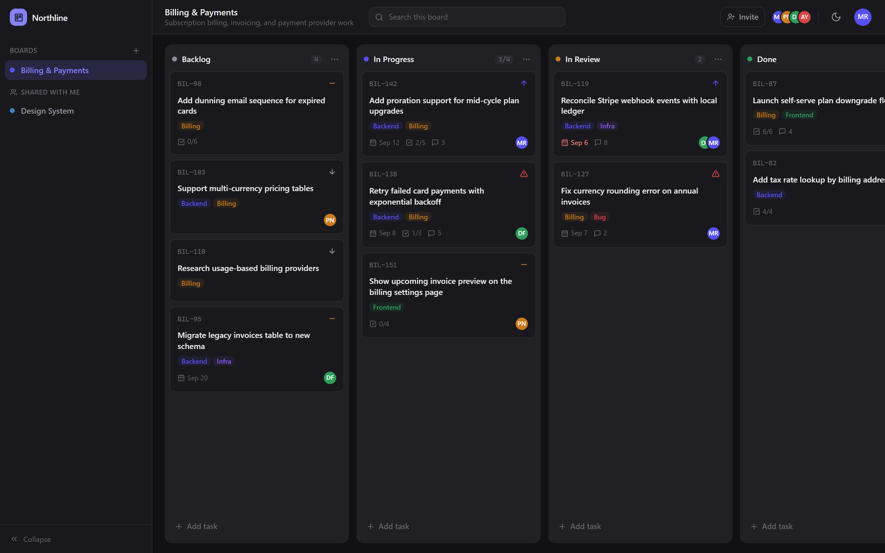

# Northline — Kanban Board 🗂️

A modern, full-stack **Kanban project management app**. Organize work into boards, columns, and
tasks — drag tasks between columns, tag them with labels and priorities, assign teammates, set due
dates, and track subtask progress. Each board can be shared with other people, with clear roles for
who can edit and who can only look.

> **Northline** is the name you'll see in the app UI. The repository is simply a kanban board.

---

## 📸 Screenshots

**The main board** — columns, task cards, labels, priorities, due dates, assignees, and a WIP limit (`3/4`):



| Sign in / Create account | Task details drawer |
| :---: | :---: |
|  |  |

| Sign-up page | Dark mode 🌙 |
| :---: | :---: |
|  |  |

---

## ✨ What you can do

**Boards & tasks**
- Create boards with a name, description, and color
- Organize work in columns (Backlog, In Progress, …) and reorder them
- Create tasks and **drag & drop** them between columns or up/down within a column
- Every task gets a short human ID like `BIL-142` (auto-generated per board)
- Set **priority** (low / medium / high / urgent), **due dates**, **labels**, and **assignees**
- Track subtask progress (`2/5`) and comments count on each card
- Optional **WIP limits** per column (e.g. max 4 tasks in progress)
- Search across the current board

**Collaboration**
- Invite teammates to a board by email
- Three roles: **owner** (full control), **editor** (edit content & invite), **viewer** (read-only)
- "Shared with me" section shows boards other people invited you to

**Accounts & UI**
- Email + password sign-up and login (JWT-based sessions)
- Light / dark theme toggle
- Responsive layout with a collapsible sidebar

---

## 🛠️ Tech stack

| | Frontend (`frontend/`) | Backend (`backend/`) |
| --- | --- | --- |
| **Framework** | Next.js 14 (App Router) + React 18 | Node.js + Express 4 |
| **Language** | TypeScript | TypeScript |
| **Styling** | Tailwind CSS + CSS variables theming | — |
| **Drag & drop** | @dnd-kit | — |
| **Database** | — | PostgreSQL (via Prisma ORM) |
| **Cache / rate limiting** | — | Redis (ioredis) |
| **Auth** | JWT stored client-side | JWT signing, bcrypt password hashing, token blacklist |
| **Other** | next-themes, lucide-react icons | Zod validation, Helmet, Docker Compose for Postgres/Redis |

---

## 🏃 Getting started

### Prerequisites
- **Node.js 20+** and npm
- **Docker Desktop** (runs PostgreSQL + Redis for the backend)

### 1. Start the backend (API on `http://localhost:4000`)

```bash
cd backend
npm install
npm run docker:up     # starts PostgreSQL + Redis containers
npm run dev           # starts the API + applies migrations + seeds demo data
```

### 2. Start the frontend (on `http://localhost:3000`)

```bash
cd frontend
npm install
npm run dev
```

Then open **http://localhost:3000** — create your own account, or use a ready-made demo account:

| Email | Password | Name |
| --- | --- | --- |
| `mamun@company.io` | `password123` | Mamun Rashid |
| `priya@company.io` | `password123` | Priya Nair |
| `diego@company.io` | `password123` | Diego Ferreira |

> Demo accounts come from the seed script (`backend/prisma/seed.ts`) and include two boards with
> sample tasks — **Billing & Payments** and **Design System**. Never use these credentials in production.

For detailed setup (environment variables, ports, Docker, troubleshooting) see
[`backend/README.md`](backend/README.md) and [`frontend/README.md`](frontend/README.md).

---

## 🗂️ Project structure

```
kanban-board/
├── frontend/               # Next.js UI (boards, columns, drag & drop, auth pages)
│   ├── app/                #   pages: /, /login, /register
│   ├── components/         #   board, task drawer, sidebar, dialogs
│   └── lib/                #   API client, auth provider, data store
├── backend/                # Express API (auth, boards, columns, tasks)
│   ├── prisma/             #   schema, migrations, seed (demo data)
│   ├── src/routes/         #   /api/auth, /api/boards, /api/columns, /api/tasks
│   ├── src/controllers/    #   request handlers
│   ├── src/lib/            #   prisma, redis, jwt, password, rate limiting
│   ├── DB_Diagram.md       #   Mermaid database diagram (ER model)
│   └── docker-compose.yml  #   PostgreSQL + Redis (+ API container)
└── docs/screenshots/       # images used in this README
```

---

## 🔗 More documentation

- **[Database design](backend/DB_Diagram.md)** — ER diagram of the PostgreSQL schema (users, boards, members, columns, tasks, labels, assignees)
- **[Backend API](backend/README.md)** — full setup guide, environment variables, and API reference
- **[Frontend](frontend/README.md)** — UI architecture, drag & drop logic, theming
