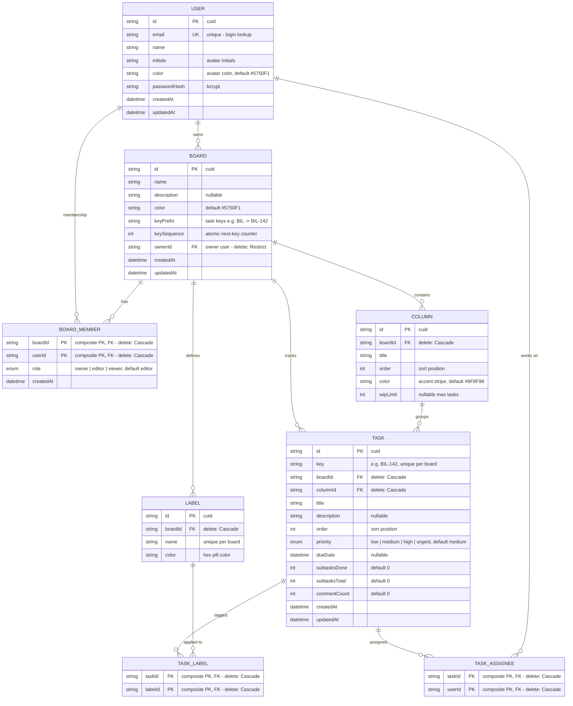

# Database Design (ER Diagram)

PostgreSQL schema for the Kanban backend, defined in [`prisma/schema.prisma`](prisma/schema.prisma).
The diagram below is a [Mermaid](https://mermaid.js.org/) ER diagram — GitHub renders it natively.

## Enums

| Enum | Values |
| --- | --- |
| `Role` | `owner` · `editor` · `viewer` |
| `Priority` | `low` · `medium` · `high` · `urgent` |

## Relationships & delete behavior

| Relationship | Cardinality | On delete |
| --- | --- | --- |
| User → Board (owner) | 1 : N | **Restrict** (can't delete a user who owns a board) |
| User ↔ Board (membership) | N : M via `BoardMember` | Cascade |
| Board → Column | 1 : N | Cascade |
| Board → Label | 1 : N | Cascade |
| Board → Task | 1 : N | Cascade |
| Column → Task | 1 : N | Cascade |
| Task ↔ Label | N : M via `TaskLabel` | Cascade |
| Task ↔ User (assignee) | N : M via `TaskAssignee` | Cascade |

## Performance notes (hot query paths)

Indexes are placed exactly where the app reads/writes most:

| Index | Model | Drives |
| --- | --- | --- |
| `email @unique` | User | Login / lookup |
| `(ownerId)` | Board | `GET /boards/mine` |
| `(userId)` | BoardMember | `GET /boards/shared` |
| `(boardId, order)` | Column | Board load + column ordering |
| `(boardId, key) @unique` | Task | Human task keys (`BIL-142`) |
| `(columnId, order)` | Task | Column render + move/reorder |
| `(boardId, name) @unique` | Label | Duplicate label names |
| `(userId)` | TaskAssignee | "Tasks assigned to me" |
